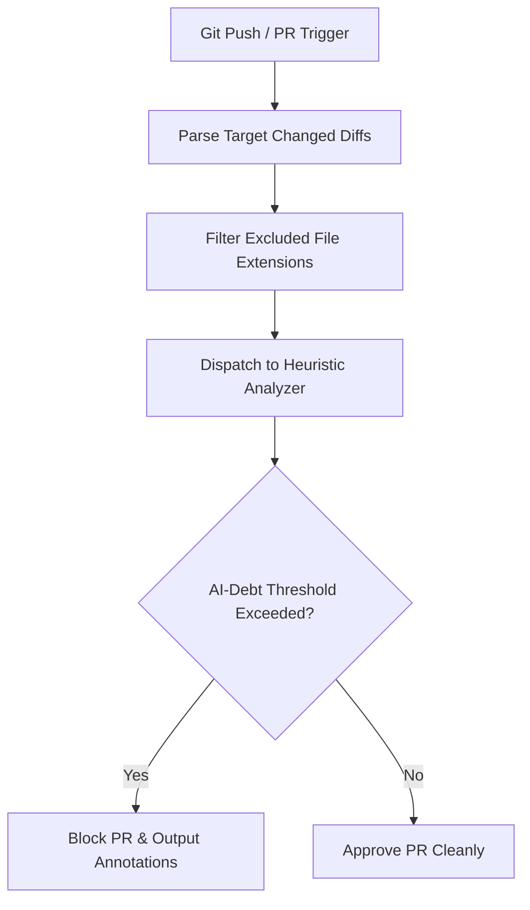

# Execution Pipeline Workflow

```mermaid
graph TD
    A[Git Push / PR Trigger] --> B[Parse Target Changed Diffs]
    B --> C[Filter Excluded File Extensions]
    C --> D[Dispatch to Heuristic Analyzer]
    D --> E{AI-Debt Threshold Exceeded?}
    E -->|Yes| F[Block PR & Output Annotations]
    E -->|No| G[Approve PR Cleanly]
```
